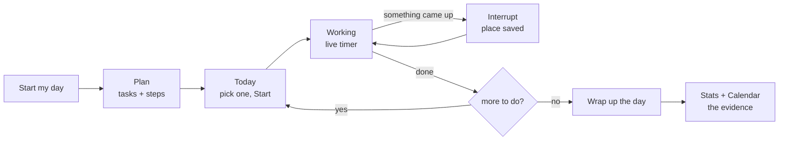

<div align="center">


### A menu-bar day tracker for ADHD brains — built around the time you _lose_, not just the time you spend.

[](https://github.com/immanuelsavio/Remi/actions/workflows/ci.yml)
[](LICENSE)
[](#installation)
[](PRIVACY.md)

</div>

---

## What Remi is

Remi lives in your **menu bar** — no Dock icon, no window in your way. Click the mark and a
small popover drops down under it. There's a second, larger window for planning the day and
looking at the evidence afterwards.

It's built for the three things that actually make a day hard when you have ADHD:

| The difficulty                                               | What Remi does about it                                                       |
| ------------------------------------------------------------ | ----------------------------------------------------------------------------- |
| **Time blindness** — no felt sense of how long anything took | A live timer in the menu bar itself. Nothing to click, always in view.        |
| **Avoidance** — a task quietly slides day to day             | Counts how many days it's been carried, and nudges gently at three.           |
| **Invisible interruption cost**                              | Records every interruption, how long it lasted, and _which task paid for it_. |

## The part other trackers miss

Every time tracker answers _"how long did you work on this?"_ Remi also answers
_"how long did this **take** — wall-clock, first touch to done?"_

```
focused time actually spent                 2h
real elapsed span (first start → done)      5h
                                          ────
the gap interruptions cost                  3h
```

That gap is why you can estimate a task correctly and still lose the whole day. Remi treats it
as first-class evidence rather than a rounding error — so "it should have taken two hours" and
"it took me all day" can both be true, on the record, with the reason attached.

Remi never scolds. The copy is _"You've moved this 3 days running — are you avoiding it? Try
just the first small step,"_ never **OVERDUE**.

---

## Features

**Working the day**

- **Tasks and steps** — one level deep, on purpose. Deeper nesting becomes planning-as-procrastination.
- **Promote a step** (`⤴`) — when a step turns out to be the real work, lift it into a task of its own. It keeps the time it already accrued.
- **Task map** — every task with its steps as branches; switch to any node, or promote from here.
- **Interrupt** — "something came up" saves your place, records what pulled you away, and brings you back when you're done.
- **Break timer** — pauses the clock properly; a break is a quiet corner, not another button on the main screen.
- **Backlog** — a parking lot, so "I should also…" can leave your head without derailing today.
- **Reminders** — three ways to say _when_, because people think about later in three different ways: **in** 30 minutes, **by** 2pm, or **on** a date and time.
- **Tags** — label a task by project or kind (`#acme`, `#coding`). Normalised on the way in, so `#Acme`, `Acme` and `#acme ` are one tag, not three.
- **Reopen a day you ended** — and it comes back the way you left it: what you sent to tomorrow returns marked as such, what you parked stays parked. Time already banked is never rewound.

**Understanding the day**

- **Bounded check-ins** — a gentle "still on this?" at 1×, 2×, then 4× your interval, then it stops asking. It backs off; it doesn't nag.
- **Time-sense trainer** — estimate a task up front, and learn over time how your guesses compare with reality.
- **Interruption evidence** — what interrupts you most, total time lost, and the tasks whose day ran longest past their focused time.
- **Streaks** — weekends and days off bridge them; they never break them. One revive heart to rescue a genuinely missed day, spent deliberately.
- **Calendar** — a record of what actually happened, not a planner. Green finished, orange left something open.
- **Notes** — free text beside any task or step; it travels with the task across days and into your backup.
- **Search** — every finished task, by title or tag, across all history and today, newest first with a running total. Unfinished work is one toggle away.
- **Work record** — a printable report of what you actually finished: per-task focused time, anything left open, and optionally the interruptions that cost it. Whole history, this year, this month or an explicit date range, filterable by tag. **Print → Save as PDF** and it's a file you can hand over.

**Living with it**

- **Wellness nudges** — water, stand, walk, lunch, break. All **off by default**, one at a time, never during a break, and they never touch your task clock.
- **Import a task list** — paste an LLM's output or a text file; copy the formatting prompt straight from the app.
- **Themes** — light and dark, seven accent colours. The default is sampled from Remi's own icon.
- **Private notifications** — keep task names out of banners, so a screen share doesn't leak your day.
- **In-app updates** — Remi checks GitHub for a newer release and offers it as a button. The
  download is checksum-verified before it replaces anything, and you see what changed afterwards.
- **A guided tour** — fourteen steps through the whole app, run once on a first launch and re-runnable any time from **Settings → Help**. Pinned to a corner rather than shown as a modal, so it can point at a thing without covering it.
- **Remi, animated** — the mouse from the icon, live: running while your clock runs, asleep through a break, waiting when nothing is timed, cheering once when today's list is clear. One switch in Settings turns it off, and `prefers-reduced-motion` stops it at the OS level regardless.
- **Tell us what's wrong** — a feedback box in Data that travels with your exported logs.

---

## Installation

> **Heads up:** Remi is ad-hoc signed, not notarized by Apple (that needs a paid Developer
> account). The installer verifies the download's SHA-256 against the release's `checksums.txt`
> **before** extracting anything, then clears the quarantine flag on the installed bundle only.
> Gatekeeper itself is never disabled and no other app is touched.

### Recommended — inspect, then run

```bash
curl -fsSLo remi-install.sh https://raw.githubusercontent.com/immanuelsavio/remi/main/install.sh
less remi-install.sh          # read it first; it's short
bash remi-install.sh --launch
```

### One-liner

```bash
curl -fsSL https://raw.githubusercontent.com/immanuelsavio/remi/main/install.sh | bash
```

**Installs to `~/Applications/Remi.app`** — your home folder's Applications, not the
system-wide `/Applications`. This is why no password is needed. Finder's sidebar shortcut
called **Applications** points at `/Applications`, so a default install will _not_ appear
there; use Spotlight, Launchpad, or open `~/Applications` directly (in Finder:
<kbd>⇧</kbd><kbd>⌘</kbd><kbd>G</kbd> → `~/Applications`). Pass `--system` to install to
`/Applications` instead, which will prompt for your password.

| Flag               | Effect                                                   |
| ------------------ | -------------------------------------------------------- |
| `--system`         | Install to `/Applications` instead (may prompt for sudo) |
| `--launch`         | Open Remi once it's installed                            |
| `--version v0.1.0` | Install a specific tagged release instead of the latest  |

Re-running the installer upgrades in place, and rolls back if the replacement copy fails.

### Manual download

Grab the `.tar.gz` for your architecture from [Releases](https://github.com/immanuelsavio/Remi/releases),
verify it, then unpack it:

```bash
shasum -a 256 -c checksums.txt --ignore-missing
tar -xzf Remi-0.1.0-macos-aarch64.tar.gz
mv Remi.app /Applications/
xattr -dr com.apple.quarantine /Applications/Remi.app   # or right-click → Open
```

Without that last step macOS will say _"Remi cannot be opened because the developer cannot be
verified."_ That's expected for an unnotarized app — right-click the app and choose **Open**
to approve it once, or run the `xattr` command above.

### After installing

**Look at your menu bar, not your Dock.** Remi has no Dock icon by design. Opening it from
Finder or Spotlight brings up the dashboard; the menu-bar mark is always there.

**Can't find the app itself?** A default install lives in `~/Applications`, not
`/Applications` — see the note above. `ls ~/Applications/Remi.app` settles it.

---

## Using it



**A normal day.** Press **Start my day**. The dashboard opens on **Plan** — type your tasks,
press <kbd>Enter</kbd> between them, and add steps under any of them. Switch to **Today** (or
just use the menu-bar popover) and hit **Start** on whatever you're beginning with.

While a task runs, the popover shows the live timer and three actions: **Done**, **Subtask**
(add a step without leaving the task), and **Interrupt**. The menu-bar mark can show the
elapsed time too — that's the whole point of living up there.

**When something pulls you away**, press Interrupt and pick what you moved to. Remi remembers
where you were, brings you back afterwards, and quietly records how long the detour took and
which task lost the time.

**At the end**, **Wrap up the day**. Anything unfinished carries to tomorrow with its notes,
steps and reminders intact — only the clock resets, because tomorrow is new work. You can decide
per task instead (tomorrow / backlog / drop), and if you wrap up without deciding, everything
carries. Ended it too early? **Reopen the day** and it returns the way you left it.

**Afterwards**, Calendar holds the record and search finds any finished task by title or tag.
When someone needs to see the work rather than take your word for it, **Data → Export a work
record** builds a printable page for any date range or tag.

### The two windows

|                | Popover (380×560)                                        | Dashboard (opens maximized)                               |
| -------------- | -------------------------------------------------------- | --------------------------------------------------------- |
| **Opens from** | The menu-bar mark                                        | Dock, Spotlight, or the popover's ⊞ button                |
| **For**        | Working the day, one thing at a time                     | Planning it, and looking at the evidence                  |
| **Has**        | Start day · Today · Working · Break · Task map · Backlog | Plan · Today · Calendar · Stats · Data · Notes · Settings |

The popover floats above everything — including other apps' **fullscreen Spaces**, so it works
without dropping you out of fullscreen VS Code.

---

## Your data

Everything is a plain JSON file on your own machine. **Remi has no server, no account and no
telemetry.** The only thing it fetches is its web fonts, once, from Google Fonts; if that fails
it falls back to system fonts and works normally. Nothing about your tasks ever leaves the
machine.

| What                    | Where                                                                |
| ----------------------- | -------------------------------------------------------------------- |
| Tasks, history, streaks | `~/Remi/state.json` (plus `.bak` and a recovery folder)              |
| Settings                | `~/Library/Application Support/com.immanuelsavio.remi/settings.json` |
| Backups and exports     | `~/Remi/`                                                            |

Writes are atomic, a known-good backup is always kept, and a file Remi can't parse is **copied
aside, never deleted or overwritten**. See [docs/data-durability.md](docs/data-durability.md)
for the full contract.

Anonymous usage counts (which buttons and screens, feature counts, error messages) are **on by
default during the beta** and are a one-click switch in Data. No task titles, notes, steps,
backlog or reminder text is ever recorded, and nothing is transmitted — an export is a file you
hand over yourself. The feedback box is the deliberate exception: it holds your own words, and
the exported file flags itself as containing content when it does. Details in
[PRIVACY.md](PRIVACY.md).

## Uninstalling

Remove the app, keep your data:

```bash
curl -fsSLo remi-uninstall.sh https://raw.githubusercontent.com/immanuelsavio/remi/main/uninstall.sh
bash remi-uninstall.sh          # add --system if you installed to /Applications
```

Your tasks and settings stay put, so reinstalling picks up where you left off.

To delete everything permanently — **this cannot be undone**:

```bash
bash remi-uninstall.sh --purge --yes
```

---

## Building from source

**You need:** Node 20+, Rust stable (with `rustfmt` and `clippy`), and Xcode Command Line Tools.

```bash
npm install
npm run app       # launches the real menu-bar app in dev mode
npm run release   # bundles a real .app
```

```bash
npm test          # frontend unit tests
npm run check     # Svelte + TypeScript
npm run verify    # everything CI runs, including cargo test/fmt/clippy

bash tests/scripts/test-install.sh     # installer tests (real, no mocks)
bash tests/scripts/test-uninstall.sh
```

`npm run verify` is the gate. If it's green, CI will be too.

### How it fits together

```
┌──────────────────── one Tauri process ────────────────────┐
│  popover webview            dashboard webview             │
│  startClock({owner:true})   startClock({owner:false})     │
│  ── fires notifications     ── display only               │
│              └──── invoke() / events ────┘                │
│                          ▼                                │
│   src-tauri/  paths · atomic state I/O · migration ·      │
│               commands · tray · windows (NSPanel overlay) │
│                          ▼                                │
│   ~/Remi/state.json  (+ .bak, + recovery folder)          │
└───────────────────────────────────────────────────────────┘
```

Both windows load the same bundle; `src/app/window-router.ts` picks which view to mount. Only
the popover owns background effects — two owners would mean duplicate notifications.

There are invariants here that have broken real user data before. **Read
[CLAUDE.md](CLAUDE.md) before changing timing, the day lifecycle, or state I/O.**

### Platform support

macOS 10.15+ is what ships today: the installer, the release artifacts and the manual test
checklist are all macOS. Windows code paths exist and compile (including an atomic-replace
implementation for state writes), but there are **no published Windows builds yet** and it is
untested. Linux is possible via Tauri but unexplored.

---

## Contributing

Issues and pull requests are welcome — start with [CONTRIBUTING.md](CONTRIBUTING.md). Found a
security problem? Please follow [SECURITY.md](SECURITY.md) rather than opening a public issue.

## Documentation

| Doc                                                                  | What's in it                                               |
| -------------------------------------------------------------------- | ---------------------------------------------------------- |
| [docs/product.md](docs/product.md)                                   | What the app does, and why each feature exists             |
| [docs/architecture.md](docs/architecture.md)                         | How the pieces fit together                                |
| [docs/timing-and-interruptions.md](docs/timing-and-interruptions.md) | The session-transaction and interruption-evidence contract |
| [docs/data-durability.md](docs/data-durability.md)                   | State I/O guarantees and legacy-data migration             |
| [docs/development.md](docs/development.md)                           | Setup, commands, troubleshooting                           |
| [docs/manual-smoke-test.md](docs/manual-smoke-test.md)               | What only a human clicking the real app can verify         |
| [CHANGELOG.md](CHANGELOG.md)                                         | What changed, per release                                  |

## About the mouse

Remi is a mouse. It's on the app icon, curled over the check-ring in the wordmark, and it is the
silhouette in your menu bar. Inside the app it's drawn as live SVG so it can move — and the pose
is a readout, not decoration: **running** while the clock runs, **asleep** during a break,
**awake and waiting** when nothing is timed, **cheering** once when today's list is clear.

That's the same reason the timer lives in the menu bar. A running mouse in the corner of your eye
says _time is being spent_ faster than a number does, which matters when the whole app exists for
people whose sense of elapsed time is unreliable.

If that's the last thing you need in your peripheral vision, **Settings → Appearance → Remi the
mouse** turns it off, and the app respects `prefers-reduced-motion` whatever that switch says.

## About the name

The repository, the app, the bundle ID (`com.immanuelsavio.remi`) and the data folder (`~/Remi`)
all say **Remi**. An earlier development build was called **Dopamigo**; if you have data from
it, Remi copies it in on first launch and leaves the original untouched — see
[docs/data-durability.md](docs/data-durability.md#legacy-dopamigo-mvp--remi-migration).

## License

[PolyForm Noncommercial 1.0.0](LICENSE) © 2026 Immanuel Savio

In plain terms: **use it, modify it and share it freely for any
non-commercial purpose** — personal use, hobby projects, study, research,
and use by charities, schools, public research bodies and government. What
you may _not_ do is sell it, or use it commercially, without permission.

If you want to use Remi commercially, open an issue and ask — the answer is
not automatically no.

Remi bundles third-party open-source components, each under its own licence
and held by its own authors. They are listed in
[THIRD-PARTY-NOTICES.md](THIRD-PARTY-NOTICES.md); Remi's licence does not
restrict them, and theirs do not extend to Remi.
